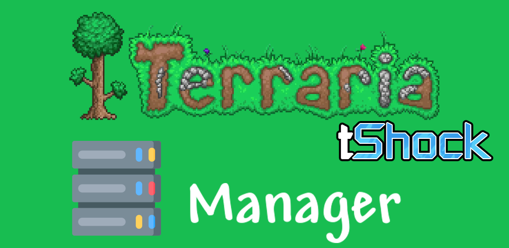

## Working both Local and External Address

Just make sure your server address is non-https or https.

And check the REST port number.

You should provide to the app the server REST PORT, not the server PORT that connect via Terraria game client

[Google Play](https://play.google.com/store/apps/details?id=br.com.adriankohls.tshock_server_rest_client)

App Client Screenshots

    
   
   
   
   
   
   
   
   
   
   
   
   
   
   
    

